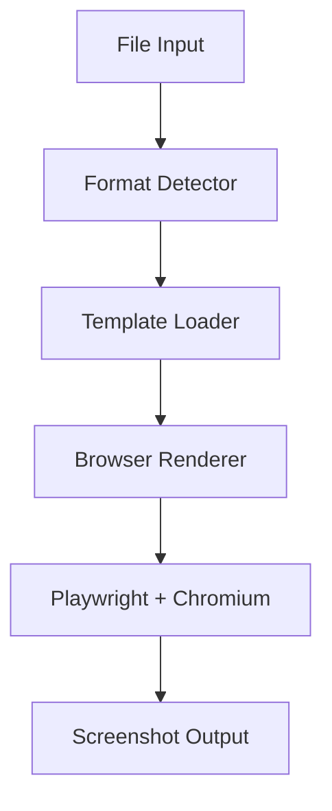
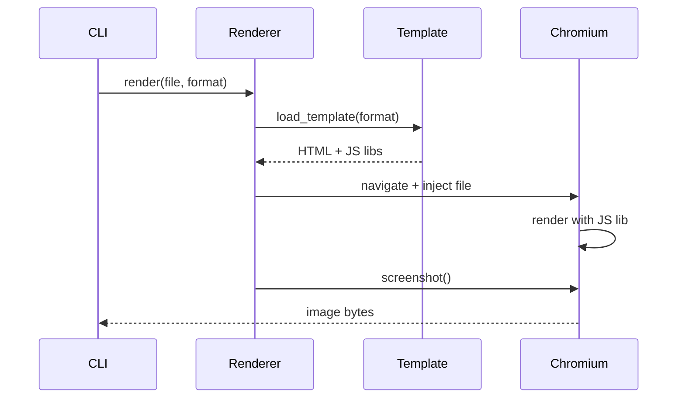
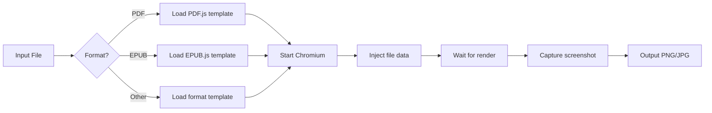

# Technical Design

## Overview

`screenitshot` converts various file formats to high-quality screenshots using a browser-based rendering approach with pinned dependencies for reproducibility.

## Architecture



## Core Components

### 1. Format Detector
- Identifies file type via MIME type and extension
- Selects appropriate template

### 2. Template Loader
- Loads HTML template for detected format
- Each template bundles appropriate JS rendering library

### 3. Browser Renderer



### Template System

Each format has an HTML template that:
1. Loads the appropriate JS rendering library (e.g., PDF.js)
2. Receives file data via Playwright injection
3. Renders content in viewport
4. Signals ready state for screenshot capture

**Template interface** (conceptual):
```python
class Template:
    js_library: str      # CDN or bundled JS lib
    init_script: str     # Initialization code
    ready_selector: str  # DOM selector indicating render complete
```

## Technology Stack

### Core Dependencies
- **Playwright**: Browser automation (pinned version)
- **Chromium**: Bundled via Playwright (fixed version)

### JS Rendering Libraries (Examples)
- PDF: [PDF.js](https://github.com/mozilla/pdf.js) (pinned version)
- Additional format libraries loaded via templates (version-pinned)

### Dependency Pinning Strategy
All dependencies use exact versions:
- Python packages: `playwright==1.x.x`
- Chromium: Playwright-bundled version (auto-pinned)
- JS libraries: Pinned via lock file or vendoring

## Rendering Flow



## Configuration

Users can customize:
- Output format (PNG, JPEG, WebP)
- Resolution/viewport size
- Page range (for multi-page documents)
- Template override path

## Design Decisions

### Why Playwright + Chromium?
- **Reproducible**: Fixed Chromium version ensures consistent rendering
- **Universal**: Single approach handles all formats via JS ecosystem
- **Quality**: Full browser rendering engine with codec support
- **Ecosystem**: Mature JS libraries for every format

### Why not native libraries?
- Inconsistent quality across formats (e.g., poor EPUB support)
- Maintenance burden of multiple format-specific dependencies
- JS ecosystem has mature, well-maintained libraries for every format
- Template approach provides universal, consistent rendering

### Chrome vs Chromium?
Playwright's Chromium includes necessary codecs (H.264, AAC) and renders identically to Chrome for document use cases.

## Future Considerations

- Template caching for performance
- Parallel processing for batch operations
- Custom template plugin system
- Template marketplace/registry
