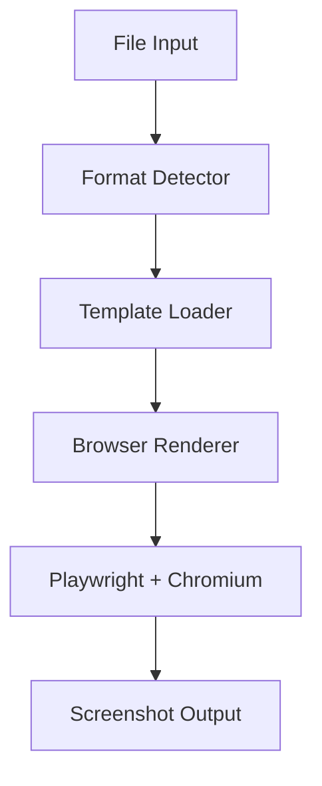
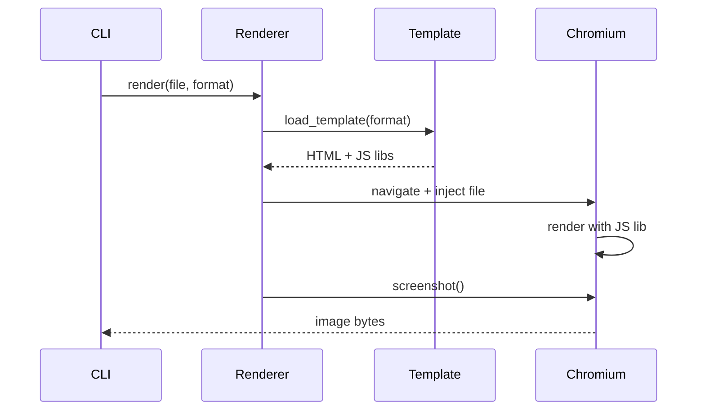
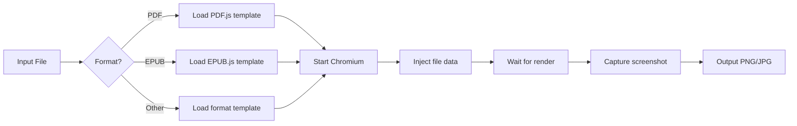

# Technical Design

## Overview

`screenitshot` converts various file formats to high-quality screenshots using a browser-based rendering approach with pinned dependencies for reproducibility.

**Core implementation**: Node.js package (primary)
**Language bindings**: Python, and potentially other languages (Go, Rust, etc.)

## Architecture



## Core Components

### 1. Format Detector
- Identifies file type via MIME type and extension
- Selects appropriate template

### 2. Template Loader
- Loads HTML template for detected format
- Each template bundles appropriate JS rendering library

### 3. Browser Renderer



### Template System

Each format has an HTML template that:
1. Loads the appropriate JS rendering library (e.g., PDF.js)
2. Receives file data via Playwright injection
3. Renders content in viewport
4. Signals ready state for screenshot capture

**Template interface**:
```typescript
// Templates expose this interface
interface TemplateAPI {
  window.fileData: ArrayBuffer | string;  // Injected by renderer
  window.renderComplete: Promise<void>;   // Resolves when ready
}
```

## Technology Stack

### Core Dependencies
- **Playwright**: Browser automation (pinned version)
- **Chromium**: Bundled via Playwright (fixed version)
- **Vite**: Build tool for ES6/TypeScript compilation and bundling
- **TypeScript**: Type-safe development

### JS Rendering Libraries (Examples)
- PDF: [PDF.js](https://github.com/mozilla/pdf.js) (pinned version)
- EPUB: [EPUB.js](https://github.com/futurepress/epub.js) (pinned version)
- Additional format libraries loaded via templates (version-pinned)

### Dependency Pinning Strategy
All dependencies use exact versions:
- npm packages: Pinned in `package.json` and `package-lock.json`
- Chromium: Playwright-bundled version (auto-pinned)
- JS rendering libraries: Pinned via `package-lock.json`

### Build Tooling: Vite (no UI framework)

**Why Vite without React/Vue/Svelte?**
- Templates are single-purpose (render one format, no interactivity)
- No state management needed
- Just need ES6 imports and bundling
- Framework overhead unnecessary for static rendering

**Template structure**:
```typescript
// src/templates/pdf.ts
import * as pdfjsLib from 'pdfjs-dist';

window.renderComplete = new Promise(async (resolve) => {
  const pdf = await pdfjsLib.getDocument(window.fileData).promise;
  const page = await pdf.getPage(1);
  // Render to canvas...
  resolve();
});
```

```html
<!-- src/templates/pdf.html -->
<!DOCTYPE html>
<html>
<body>
  <canvas id="viewer"></canvas>
  <script type="module" src="./pdf.ts"></script>
</body>
</html>
```

Vite bundles into self-contained HTML with inlined/bundled JS.

## Project Structure

```
screenitshot/                  # Monorepo
├── packages/
│   ├── core/                  # npm package (primary implementation)
│   │   ├── package.json
│   │   ├── vite.config.ts     # Build config for templates
│   │   ├── tsconfig.json
│   │   ├── src/
│   │   │   ├── cli.ts         # Node.js CLI
│   │   │   ├── api.ts         # Programmatic API
│   │   │   ├── renderer.ts    # Browser automation
│   │   │   ├── templates/
│   │   │   │   ├── pdf.html   # Template HTML
│   │   │   │   ├── pdf.ts     # Template logic (ES6)
│   │   │   │   ├── epub.html
│   │   │   │   └── epub.ts
│   │   │   └── test/
│   │   │       └── upload.html # Dev test harness
│   │   └── dist/              # Built artifacts
│   │       └── templates/     # Bundled HTML files
│   │
│   ├── python/                # Python binding
│   │   ├── pyproject.toml
│   │   └── screenitshot/
│   │       ├── __init__.py
│   │       └── cli.py         # Thin wrapper calling npm package
│   │
│   └── go/                    # Future: Go binding
│       └── ...
│
└── docker/
    └── Dockerfile             # Uses npm package directly
```

## Build & Distribution

### Primary: npm Package

**Package**: `screenitshot` on npm

```bash
npm install -g screenitshot
screenitshot file.pdf output.png
```

**Programmatic usage**:
```typescript
import { screenshot } from 'screenitshot';
await screenshot('file.pdf', { output: 'output.png' });
```

### Language Bindings

Language bindings are **thin wrappers** that invoke the npm package CLI or spawn Node.js process.

#### Python Binding

**Installation**: `pip install screenitshot`

**Implementation approach**:
```python
# screenitshot/__init__.py
import subprocess
import shutil

def screenshot(input_file: str, output: str = None):
    """Thin wrapper calling npm package"""
    npm_cli = shutil.which('screenitshot')  # From npm install -g
    if not npm_cli:
        raise RuntimeError("npm package 'screenitshot' not found. Install: npm install -g screenitshot")

    subprocess.run([npm_cli, input_file, output], check=True)
```

**Requirements**:
- User must have Node.js and npm package installed
- Python package is just a convenience wrapper
- Or bundle Node.js binary (like pkg/nexe)

#### Future Bindings (Go, Rust, etc.)

Same pattern: thin wrapper calling the npm package.

### Docker Distribution (Default)

```dockerfile
FROM node:20-slim

# Install chromium dependencies
RUN apt-get update && apt-get install -y \
    chromium \
    && rm -rf /var/lib/apt/lists/*

# Install npm package globally
RUN npm install -g screenitshot && \
    npx playwright install chromium

ENTRYPOINT ["screenitshot"]
```

**Usage**:
```bash
docker run screenitshot file.pdf output.png
```

## Rendering Flow



## Configuration

Users can customize:
- Output format (PNG, JPEG, WebP)
- Resolution/viewport size
- Page range (for multi-page documents)
- Template override path

## Design Decisions

### Why Playwright + Chromium?
- **Reproducible**: Fixed Chromium version ensures consistent rendering
- **Universal**: Single approach handles all formats via JS ecosystem
- **Quality**: Full browser rendering engine with codec support
- **Ecosystem**: Mature JS libraries for every format

### Why not native libraries?
- Inconsistent quality across formats (e.g., poor EPUB support)
- Maintenance burden of multiple format-specific dependencies
- JS ecosystem has mature, well-maintained libraries for every format
- Template approach provides universal, consistent rendering

### Chrome vs Chromium?
Playwright's Chromium includes necessary codecs (H.264, AAC) and renders identically to Chrome for document use cases.

### Architecture Decision: npm-first approach

**Core (npm package)** - 100% of logic:
- Format-specific rendering logic (PDF.js, EPUB.js, etc.)
- Template creation and maintenance (Vite builds)
- Browser APIs and rendering
- CLI interface and argument parsing
- File I/O and format detection
- Browser lifecycle management (Playwright)
- Screenshot capture configuration

**Language bindings** - Thin wrappers:
- Python: `subprocess.run(['screenitshot', ...])`
- Go: `exec.Command('screenitshot', ...)`
- Rust: `Command::new('screenitshot')`
- Just for convenience in those ecosystems

**Benefits**:
- ✅ Single source of truth (npm package)
- ✅ All features available in all languages immediately
- ✅ Easy to add new language bindings
- ✅ Simpler maintenance (fix once, benefits all)
- ✅ Docker uses npm package directly (primary distribution)

### Why Vite without UI framework?

**Requirements**:
- ES6 module imports for rendering libraries
- TypeScript support
- Bundle optimization and minification
- Dev server for testing templates

**Why not React/Vue/Svelte?**:
- Templates are static renderers (no user interaction)
- No component lifecycle or state management needed
- Framework adds unnecessary bundle size
- Simple: load library → render content → signal complete

**Result**: Plain HTML + TypeScript compiled by Vite = minimal, fast templates

## Future Considerations

- Template caching for performance
- Parallel processing for batch operations
- Custom template plugin system
- Template marketplace/registry
