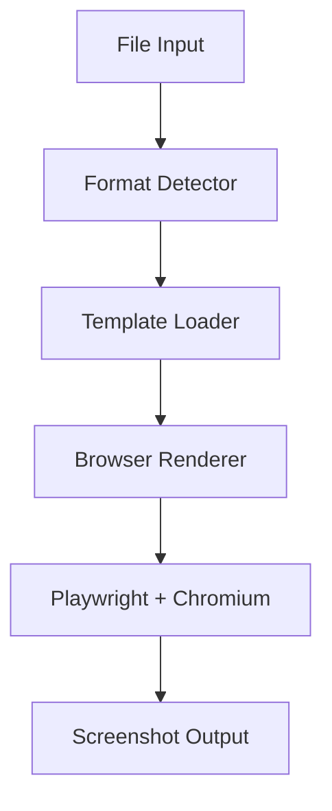
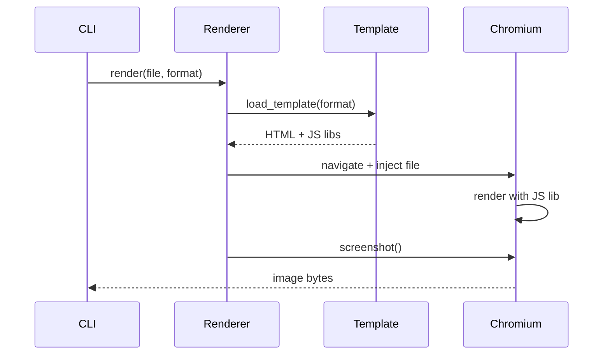
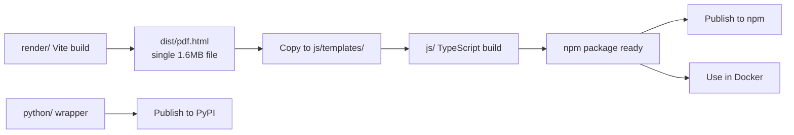
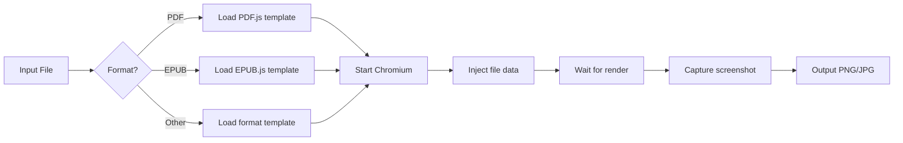

# Technical Design

## Overview

`screenitshot` converts various file formats to high-quality screenshots using a browser-based rendering approach with pinned dependencies for reproducibility.

**Core implementation**: Node.js package (primary)
**Language bindings**: Python, and potentially other languages (Go, Rust, etc.)

## Architecture



## Core Components

### 1. Format Detector
- Identifies file type via MIME type and extension
- Selects appropriate template

### 2. Template Loader
- Loads HTML template for detected format
- Each template bundles appropriate JS rendering library

### 3. Browser Renderer



### Template System

Each format has an HTML template that:
1. Loads the appropriate JS rendering library (e.g., PDF.js)
2. Receives file data via Playwright injection
3. Renders content in viewport
4. Signals ready state for screenshot capture
5. Supports both Playwright automation and manual testing modes

**Full specification**: See [render/RENDERER_SPEC.md](../render/RENDERER_SPEC.md) for complete interface requirements and implementation guide.

**Template interface**:
```typescript
// Global variables (input from Playwright)
let fileBase64 = (globalThis as any).fileBase64 || 'FILE_BASE64_PLACEHOLDER';
let pageNumber = (globalThis as any).pageNumber || 1;

// Window API (output to Playwright)
interface RenderMetadata {
  width: number;        // Rendered canvas width
  height: number;       // Rendered canvas height
  pageCount: number;    // Total pages (for multi-page formats)
  pageNumber: number;   // Current page rendered
  scale: number;        // Scale factor used
}

declare global {
  interface Window {
    renderComplete: Promise<RenderMetadata>;
  }
}

// Set on page load
window.renderComplete = renderDocument();
```

**Communication Flow**:
1. Page sets `window.renderComplete` to a Promise
2. Playwright awaits the Promise via `page.evaluate()`
3. Promise resolves with metadata when rendering completes
4. Playwright resizes viewport to match rendered dimensions
5. Screenshot captures exact content without cropping

This approach is robust because:
- No polling needed (Promise-based async/await)
- Type-safe metadata exchange
- Automatic viewport sizing based on actual content
- Prevents race conditions (waits for true completion)

## Technology Stack

### Core Dependencies
- **Playwright**: Browser automation (pinned version)
- **Chromium**: Bundled via Playwright (fixed version)
- **Vite**: Build tool for ES6/TypeScript compilation and bundling
- **TypeScript**: Type-safe development

### JS Rendering Libraries (Examples)
- PDF: [PDF.js](https://github.com/mozilla/pdf.js) (pinned version)
- EPUB: [EPUB.js](https://github.com/futurepress/epub.js) (pinned version)
- Additional format libraries loaded via templates (version-pinned)

### Dependency Pinning Strategy
All dependencies use exact versions:
- npm packages: Pinned in `package.json` and `package-lock.json`
- Chromium: Playwright-bundled version (auto-pinned)
- JS rendering libraries: Pinned via `package-lock.json`

### Build Tooling: Vite + vite-plugin-singlefile

**Why Vite without React/Vue/Svelte?**
- Templates are single-purpose (render one format, no interactivity)
- No state management needed
- Just need ES6 imports and bundling
- Framework overhead unnecessary for static rendering

**Build Strategy: Inline Everything**
- Uses `vite-plugin-singlefile` to inline all JS/CSS into a single HTML file
- Avoids CORS issues with `file://` protocol (required for Playwright)
- Each template becomes a completely self-contained HTML file (~1.6MB for PDF)
- No external dependencies or asset files needed at runtime

**Template structure**:
```typescript
// render/pdf.ts
import * as pdfjsLib from 'pdfjs-dist';

// Data injected by Playwright via page.addInitScript()
let fileBase64 = (globalThis as any).fileBase64 || 'FILE_BASE64_PLACEHOLDER';
let pageNumber = (globalThis as any).pageNumber || 1;

window.renderComplete = renderPDF(); // Returns Promise<RenderMetadata>

async function renderPDF(): Promise<RenderMetadata> {
  // ... render PDF to canvas ...
  return {
    width: Math.ceil(viewport.width),
    height: Math.ceil(viewport.height),
    pageCount: pdf.numPages,
    pageNumber: pageNumber,
    scale: 2.0
  };
}
```

```html
<!-- render/pdf.html (source) -->
<!DOCTYPE html>
<html>
<body>
  <canvas id="pdf-canvas"></canvas>
  <script type="module" src="./pdf.ts"></script>
</body>
</html>
```

After Vite build with `vite-plugin-singlefile`:
```html
<!-- render/dist/pdf.html (output) -->
<!DOCTYPE html>
<html>
<body>
  <canvas id="pdf-canvas"></canvas>
  <script type="module">
    /* ALL JavaScript inlined here (~1.6MB including PDF.js) */
  </script>
</body>
</html>
```

This single-file approach:
- ✅ Works with `file://` protocol (no CORS issues)
- ✅ No asset path resolution needed
- ✅ Simpler deployment (just copy one HTML file)
- ✅ Fully self-contained templates

## Project Structure

```
screenitshot/                  # Monorepo
├── render/                    # Vite project for templates
│   ├── package.json
│   ├── vite.config.ts         # Single-file build config (vite-plugin-singlefile)
│   ├── tsconfig.json
│   ├── pdf.html               # PDF template (source)
│   ├── pdf.ts                 # PDF rendering logic (source)
│   ├── index.html             # Test/dev page (source)
│   └── dist/                  # Built output: self-contained HTML files
│       └── pdf.html           # Single 1.6MB file with all JS inlined
│
├── js/                        # Node.js package & CLI
│   ├── package.json           # npm: screenitshot
│   ├── tsconfig.json
│   ├── src/
│   │   ├── index.ts           # Programmatic API
│   │   ├── cli.ts             # CLI entry point
│   │   ├── renderer.ts        # Playwright browser automation
│   │   ├── detector.ts        # Format detection
│   │   └── types.ts           # Shared types (including RenderMetadata)
│   ├── templates/             # Copied from render/dist/ at build time
│   │   └── pdf.html           # Self-contained template (no assets folder)
│   └── dist/                  # Compiled JS
│
├── python/                    # Python binding
│   ├── pyproject.toml         # PyPI: screenitshot
│   ├── screenitshot/
│   │   ├── __init__.py        # Programmatic API
│   │   └── cli.py             # CLI entry point
│   └── README.md
│
└── docker/
    ├── Dockerfile             # Based on npm package
    └── README.md
```

## Build & Distribution

### Build Process



**Steps**:
1. `cd render && npm run build` → produces `dist/pdf.html` (self-contained, all JS inlined)
2. `cd js && npm run build` → runs `tsc` + copies `render/dist/pdf.html` to `js/templates/`
3. Publish `js/` to npm
4. Docker uses npm package from registry

**Key changes from original design**:
- ✅ Templates are now **single HTML files** with all JavaScript inlined (no separate assets folder)
- ✅ Uses `vite-plugin-singlefile` to avoid CORS issues with `file://` protocol
- ✅ Data injection via `page.addInitScript()` instead of string replacement in HTML
- ✅ Metadata callback returns viewport dimensions for automatic resizing

### Unified Package Interface

All implementations (npm, PyPI, Docker) share the same interface:

**CLI usage**:
```bash
# All platforms
screenitshot <input> [output] [options]

# Examples
screenitshot document.pdf                    # → document.png
screenitshot document.pdf output.png         # → output.png
screenitshot document.pdf --format jpeg      # → document.jpg
screenitshot document.pdf --width 1920       # Custom viewport
```

**Programmatic API**:
```typescript
// Node.js (js/)
import { screenshot } from 'screenitshot';

await screenshot('file.pdf', {
  output: 'output.png',
  format: 'png' | 'jpeg' | 'webp',
  width: 1920,
  height: 1080,
  page: 1  // For multi-page documents
});
```

```python
# Python (python/)
from screenitshot import screenshot

screenshot('file.pdf',
  output='output.png',
  format='png',  # 'png' | 'jpeg' | 'webp'
  width=1920,
  height=1080,
  page=1
)
```

### npm Package

**Package**: `screenitshot` on npm

```bash
npm install -g screenitshot
screenitshot file.pdf output.png
```

**Contents**:
- CLI binary
- Programmatic API
- Bundled templates (from `render/dist/`)
- Playwright + Chromium (auto-installed)

### Python Binding

**Package**: `screenitshot` on PyPI

```bash
pip install screenitshot
screenitshot file.pdf output.png
```

**Implementation**: Thin wrapper calling npm package CLI

```python
# python/screenitshot/__init__.py
import subprocess
import shutil
from typing import Optional

def screenshot(
    input_file: str,
    output: Optional[str] = None,
    format: str = 'png',
    width: int = 1920,
    height: int = 1080,
    page: int = 1
):
    """Thin wrapper calling npm package"""
    npm_cli = shutil.which('screenitshot')
    if not npm_cli:
        raise RuntimeError(
            "npm package 'screenitshot' not found. "
            "Install: npm install -g screenitshot"
        )

    args = [npm_cli, input_file]
    if output:
        args.append(output)
    args.extend(['--format', format, '--width', str(width)])

    subprocess.run(args, check=True)
```

**Requirements**: User must have Node.js and npm package installed

### Docker Distribution

**Image**: `screenitshot/screenitshot` (or your registry)

```dockerfile
FROM node:20-slim

# Install system dependencies for Chromium
RUN apt-get update && apt-get install -y \
    ca-certificates \
    fonts-liberation \
    && rm -rf /var/lib/apt/lists/*

# Install npm package globally
RUN npm install -g screenitshot && \
    npx playwright install --with-deps chromium

WORKDIR /app
ENTRYPOINT ["screenitshot"]
```

**Usage**:
```bash
docker run -v $(pwd):/app screenitshot /app/file.pdf /app/output.png
```

## Rendering Flow



## Configuration

### Render Quality Control

**Default Quality Settings** (High-quality by default):
- **Viewport**: 1920×1080 (Full HD browser window)
- **Scale Factor**: 2.0× (Retina/HiDPI rendering)
- **Effective Resolution**: 3840×2160 canvas (4K quality)
- **Output Format**: PNG (lossless)

**Rationale**:
- 2× scale ensures crisp text and sharp details
- 1920×1080 viewport accommodates most document layouts
- PNG preserves quality without compression artifacts
- Users can override for specific needs (JPEG for smaller files, custom viewport sizes)

**Quality vs Performance Tradeoffs**:
- Higher scale (2×) = better quality but larger files and slower rendering
- PDF pages render at their intrinsic size × scale factor
- Browser viewport should match rendered canvas size to avoid cropping

### User Customization Options

Users can customize:
- Output format (PNG, JPEG, WebP)
- Resolution/viewport size
- Scale factor (for quality control)
- Page range (for multi-page documents)
- Template override path

## Design Decisions

### Why Playwright + Chromium?
- **Reproducible**: Fixed Chromium version ensures consistent rendering
- **Universal**: Single approach handles all formats via JS ecosystem
- **Quality**: Full browser rendering engine with codec support
- **Ecosystem**: Mature JS libraries for every format

### Why not native libraries?
- Inconsistent quality across formats (e.g., poor EPUB support)
- Maintenance burden of multiple format-specific dependencies
- JS ecosystem has mature, well-maintained libraries for every format
- Template approach provides universal, consistent rendering

### Chrome vs Chromium?
Playwright's Chromium includes necessary codecs (H.264, AAC) and renders identically to Chrome for document use cases.

### Architecture Decision: npm-first approach

**Core (npm package)** - 100% of logic:
- Format-specific rendering logic (PDF.js, EPUB.js, etc.)
- Template creation and maintenance (Vite builds)
- Browser APIs and rendering
- CLI interface and argument parsing
- File I/O and format detection
- Browser lifecycle management (Playwright)
- Screenshot capture configuration

**Language bindings** - Thin wrappers:
- Python: `subprocess.run(['screenitshot', ...])`
- Go: `exec.Command('screenitshot', ...)`
- Rust: `Command::new('screenitshot')`
- Just for convenience in those ecosystems

**Benefits**:
- ✅ Single source of truth (npm package)
- ✅ All features available in all languages immediately
- ✅ Easy to add new language bindings
- ✅ Simpler maintenance (fix once, benefits all)
- ✅ Docker uses npm package directly (primary distribution)

### Why Vite without UI framework?

**Requirements**:
- ES6 module imports for rendering libraries
- TypeScript support
- Bundle optimization and minification
- Dev server for testing templates

**Why not React/Vue/Svelte?**:
- Templates are static renderers (no user interaction)
- No component lifecycle or state management needed
- Framework adds unnecessary bundle size
- Simple: load library → render content → signal complete

**Result**: Plain HTML + TypeScript compiled by Vite = minimal, fast templates

### Technical Challenges Solved

#### 1. CORS Issues with file:// Protocol
**Problem**: Vite's default build creates separate JS files referenced via `<script src="/assets/pdf-*.js">`. When loading via `file://` protocol (required for Playwright), browsers block these scripts due to CORS policy.

**Solution**: Use `vite-plugin-singlefile` to inline all JavaScript and CSS directly into the HTML file. This creates a single self-contained file that works with `file://` without CORS issues.

```typescript
// vite.config.ts
export default defineConfig({
  plugins: [viteSingleFile()], // Inline everything
  build: {
    rollupOptions: {
      input: resolve(__dirname, 'pdf.html'),
    },
  },
});
```

#### 2. Data Injection into Browser Context
**Problem**: Initial approach used string replacement in HTML templates, but with Vite bundling, the placeholders are in the bundled JavaScript, not accessible for replacement.

**Solution**: Use Playwright's `page.addInitScript()` to inject data before the page loads:

```typescript
// Inject data before template loads
await page.addInitScript(({ fileBase64, pageNum }) => {
  (globalThis as any).fileBase64 = fileBase64;
  (globalThis as any).pageNumber = pageNum;
}, { fileBase64, pageNum: pageNumber });

// Template reads from globalThis
let fileBase64 = (globalThis as any).fileBase64 || 'PLACEHOLDER';
```

#### 3. Proper PDF Size Detection
**Problem**: PDFs have intrinsic page sizes (e.g., Letter = 612×792 points), but the initial viewport was fixed at 1920×1080, causing cropping or whitespace.

**Solution**: Return metadata from the rendering Promise and resize viewport dynamically:

```typescript
// Page side: Return actual dimensions
return {
  width: Math.ceil(viewport.width),  // e.g., 1224 for Letter at 2×
  height: Math.ceil(viewport.height), // e.g., 1584 for Letter at 2×
  pageCount: pdf.numPages,
  scale: 2.0
};

// Playwright side: Resize to match
const metadata = await page.evaluate(async () => {
  return await window.renderComplete;
});

await page.setViewportSize({
  width: metadata.width,
  height: metadata.height,
});
```

Result: Screenshots are exactly the right size with no cropping.

## Implementation Plan

### Phase 1: PDF Support (MVP)

**Goal**: Working PDF → screenshot pipeline

**Tasks**:
1. **render/** - Vite project
   - Setup Vite multi-page config
   - Create `pdf.html` + `pdf.ts` using PDF.js
   - Create `test/index.html` upload page
   - Build and verify output

2. **js/** - Node.js package
   - Setup TypeScript + Playwright
   - Implement format detector (PDF only)
   - Implement renderer (launch browser, inject file, screenshot)
   - Implement CLI
   - Implement programmatic API
   - Copy templates from `render/dist/`

3. **python/** - Python binding
   - Setup pyproject.toml
   - Implement thin wrapper CLI
   - Implement thin wrapper API

4. **docker/** - Docker image
   - Create Dockerfile based on npm package
   - Test with sample PDF

**Acceptance Criteria**:
```bash
# npm
npm install -g screenitshot
screenitshot test.pdf test.png  # Works!

# Python
pip install screenitshot
screenitshot test.pdf test.png  # Works!

# Docker
docker run screenitshot test.pdf test.png  # Works!

# Programmatic
import { screenshot } from 'screenitshot';
await screenshot('test.pdf', { output: 'test.png' });  # Works!
```

### Phase 2: Additional Formats

- EPUB support
- DOCX support (via mammoth.js or docx-preview)
- Markdown support
- HTML support

### Phase 3: Advanced Features

- Multi-page rendering (generate multiple images or PDF)
- Custom CSS injection
- Template marketplace/registry
- Parallel batch processing

## Future Considerations

- Template caching for performance
- Parallel processing for batch operations
- Custom template plugin system
- Template marketplace/registry
- Go/Rust bindings
