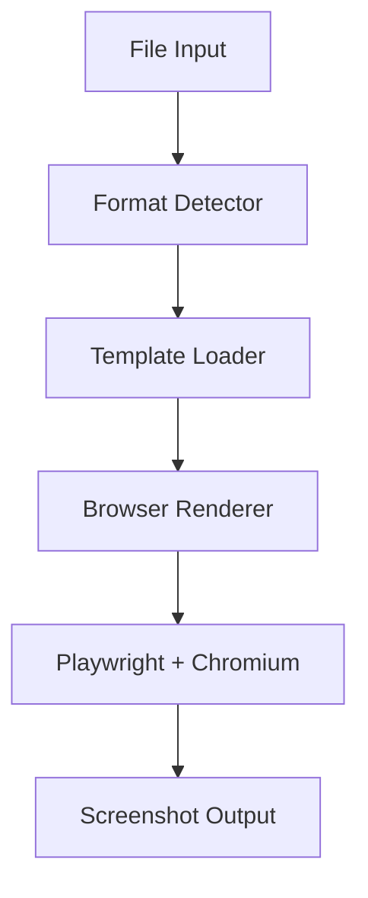
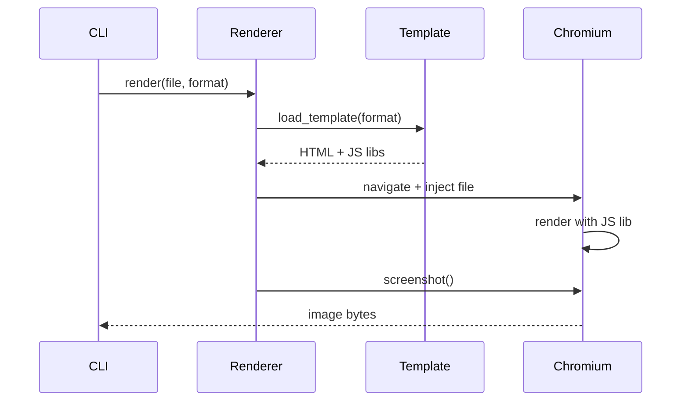
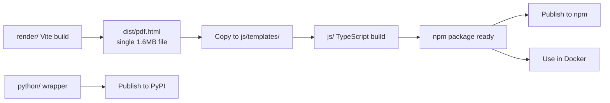
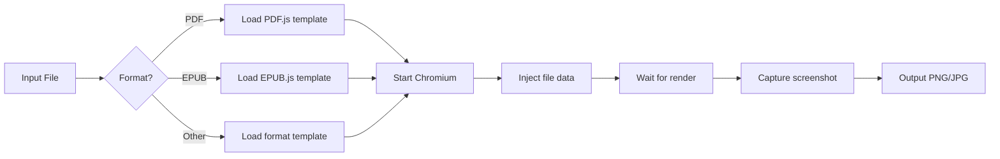

# Technical Design

## Overview

`screenitshot` converts various file formats to high-quality screenshots using a browser-based rendering approach with pinned dependencies for reproducibility.

**Core implementation**: Node.js package (primary)
**Language bindings**: Python, and potentially other languages (Go, Rust, etc.)

**Current Status**: Phase 2 in progress - PDF, DOCX, and XLSX support functional. See [Supported Formats](../README.md#supported-formats) for details.

## Architecture



## Core Components

### 1. Format Detector
- Identifies file type via MIME type and extension
- Selects appropriate template

### 2. Template Loader
- Loads HTML template for detected format
- Each template bundles appropriate JS rendering library

### 3. Browser Renderer



### Template System

Each format has an HTML template that:
1. Loads the appropriate JS rendering library (e.g., PDF.js)
2. Receives file data via Playwright injection
3. Renders content in viewport
4. Signals ready state for screenshot capture
5. Supports both Playwright automation and manual testing modes

## Renderer Specification

This section defines the interface requirements for all renderer pages (e.g., `pdf.html`, `epub.html`, etc.).

### Renderer Overview

Each renderer page is a self-contained HTML file that:
1. Renders a specific file format to a canvas
2. Works in both **manual testing mode** (file upload) and **Playwright automation mode**
3. Returns metadata via a Promise-based callback

### Required Interface

#### 1. Global Variables (Input)

Each renderer must read these values from `globalThis`:

```typescript
// Data injected by Playwright via page.addInitScript()
// Falls back to placeholders for manual testing mode
let fileBase64 = (globalThis as any).fileBase64 || 'FILE_BASE64_PLACEHOLDER';
let pageNumber = (globalThis as any).pageNumber || 1; // or other params as needed
```

**Naming Convention**:
- Use `*_PLACEHOLDER` constants for placeholder values
- Check if value equals placeholder to detect manual testing mode

#### 2. Window API (Output)

Each renderer must expose this Promise on `window`:

```typescript
interface RenderMetadata {
  width: number;        // Content width in CSS pixels
  height: number;       // Content height in CSS pixels
  pageCount: number;    // Total pages/items in document
  pageNumber: number;   // Current page/item being rendered
  scale: number;        // Scale factor used for rendering (informational)
  clipX?: number;       // Optional: X offset for clip-based screenshot
  clipY?: number;       // Optional: Y offset for clip-based screenshot
}

declare global {
  interface Window {
    renderComplete: Promise<RenderMetadata>;
  }
}

// Set immediately on page load
window.renderComplete = renderDocument();
```

**Understanding width/height and scale**:

The `width` and `height` values represent the content dimensions. How Playwright uses them depends on whether `clipX`/`clipY` are provided:

| Approach | When to use | How it works |
|----------|-------------|--------------|
| **Viewport resize** | Content fills viewport from (0,0) | Playwright resizes viewport to width×height, then screenshots |
| **Clip-based** | Content is offset or has whitespace | Playwright uses `clip: {x: clipX, y: clipY, width, height}` to capture exact content area |

| Renderer Type | Approach | Example |
|--------------|----------|---------|
| Canvas-based (PDF) | Viewport resize | Canvas at (0,0), exact size known |
| Fixed-layout (PPTX) | Viewport resize | Fixed 960×540 slide dimensions |
| DOM-based (EPUB) | Clip-based | Content may be centered/offset in container |
| DOM-based (DOCX, XLSX) | Viewport resize | Content starts at (0,0) |

The `scale` field is **informational only** - it tells what quality level the renderer used internally, but does NOT affect how Playwright handles the viewport. Playwright always uses `deviceScaleFactor: 2` regardless of this value.

**Complete flow (Viewport resize approach)**:
1. Renderer returns `{ width: 600, height: 800, scale: 2.0 }`
2. Playwright calls `page.setViewportSize({ width: 600, height: 800 })`
3. Playwright captures screenshot with `deviceScaleFactor: 2`
4. Final image: 1200×1600 pixels

**Complete flow (Clip-based approach)**:
1. Renderer returns `{ width: 1334, height: 1831, clipX: 133, clipY: 0, scale: 2.0 }`
2. Playwright resizes viewport to fit clip area: `page.setViewportSize({ width: 133+1334, height: 1831 })`
3. Playwright captures screenshot with clip: `page.screenshot({ clip: { x: 133, y: 0, width: 1334, height: 1831 } })`
4. Final image: 2668×3662 pixels (clip dimensions × deviceScaleFactor)

**Promise Resolution**:
- ✅ Resolve with `RenderMetadata` when rendering is complete
- ❌ Never reject - handle errors internally and show UI feedback
- ⏱️ Playwright waits for this Promise before taking screenshot

#### 3. Dual Mode Support

Each renderer must support **two modes**:

**Mode 1: Playwright Automation (Production)**
- `fileBase64` is injected via `page.addInitScript()`
- Render automatically on page load
- Return accurate metadata

```typescript
async function renderDocument(): Promise<RenderMetadata> {
  // fileBase64 will be injected by Playwright
  const bytes = base64ToUint8Array(fileBase64);

  // ... render logic ...

  return {
    width: actualWidth,
    height: actualHeight,
    pageCount: totalPages,
    pageNumber: currentPage,
    scale: scaleUsed
  };
}
```

**Mode 2: Manual Testing (Development)**
- Detect placeholder value
- Show file upload UI
- Allow local testing without Playwright

```typescript
async function renderDocument(): Promise<RenderMetadata> {
  // Check if running in manual testing mode
  if (fileBase64 === 'FILE_BASE64_PLACEHOLDER') {
    showFileSelector(); // Show upload UI

    // Return dummy metadata (won't be used)
    return {
      width: 1280,
      height: 960,
      pageCount: 1,
      pageNumber: 1,
      scale: 2.0
    };
  }

  // Production rendering...
}
```

**Communication Flow**:
1. Page sets `window.renderComplete` to a Promise
2. Playwright awaits the Promise via `page.evaluate()`
3. Promise resolves with metadata when rendering completes
4. Playwright resizes viewport to match rendered dimensions
5. Screenshot captures exact content without cropping

This approach is robust because:
- No polling needed (Promise-based async/await)
- Type-safe metadata exchange
- Automatic viewport sizing based on actual content
- Prevents race conditions (waits for true completion)

### HTML Structure Requirements

Each renderer page must include:

```html
<!DOCTYPE html>
<html lang="en">
<head>
  <meta charset="UTF-8">
  <meta name="viewport" content="width=device-width, initial-scale=1.0">
  <title>Format Renderer</title>

  <style>
    /* Reset and container styles */
    * {
      margin: 0;
      padding: 0;
      box-sizing: border-box;
    }

    body {
      background: white;
      overflow: hidden;
    }

    #container {
      width: 100%;
      height: 100vh;
      display: flex;
      justify-content: center;
      align-items: center;
    }

    canvas {
      display: block;
      max-width: 100%;
      max-height: 100%;
    }
  </style>
</head>
<body>
  <div id="container">
    <!-- Main rendering canvas -->
    <canvas id="format-canvas"></canvas>
  </div>

  <!-- Script will be inlined by vite-plugin-singlefile -->
  <script type="module" src="./format.ts"></script>
</body>
</html>
```

**Required IDs**:
- `container`: Main container div
- `format-canvas`: Canvas element for rendering (use descriptive name like `pdf-canvas`, `epub-canvas`)

### Format-Specific Parameters

Different formats may need different parameters injected by Playwright:

```typescript
// PDF
let fileBase64 = (globalThis as any).fileBase64 || 'FILE_BASE64_PLACEHOLDER';
let pageNumber = (globalThis as any).pageNumber || 1;

// EPUB
let fileBase64 = (globalThis as any).fileBase64 || 'FILE_BASE64_PLACEHOLDER';
let chapterNumber = (globalThis as any).chapterNumber || 1;

// Video
let fileBase64 = (globalThis as any).fileBase64 || 'FILE_BASE64_PLACEHOLDER';
let timeOffset = (globalThis as any).timeOffset || 1000; // milliseconds
```

Update `js/src/renderer.ts` `injectDataIntoPage()` method accordingly for each format.

### Checklist for New Renderers

When creating a new renderer (e.g., `epub.html`):

- [ ] Define placeholder constants (e.g., `FILE_BASE64_PLACEHOLDER`)
- [ ] Read from `globalThis` with fallback to placeholders
- [ ] Implement `renderDocument(): Promise<RenderMetadata>`
- [ ] Detect placeholder value for manual testing mode
- [ ] Show file upload UI in manual mode
- [ ] Return accurate `RenderMetadata` in production mode
- [ ] Set `window.renderComplete = renderDocument()`
- [ ] Create canvas element with descriptive ID
- [ ] Add format-specific file extensions to upload UI
- [ ] Test both Playwright and manual modes
- [ ] Verify metadata accuracy (width, height, pageCount)
- [ ] Configure Vite build with `viteSingleFile()`
- [ ] Update `js/src/renderer.ts` template map
- [ ] Update Vite config input to build new template

### Best Practices

1. **Always return actual dimensions** - Don't use hardcoded values in production mode
2. **Handle errors gracefully** - Show user-friendly error messages in manual mode
3. **Use appropriate scale** - Default to 2.0× for high-quality output
4. **Respect intrinsic sizes** - Use document's actual page/viewport dimensions
5. **Test both modes** - Verify Playwright automation and manual upload work
6. **Keep placeholders obvious** - Use ALL_CAPS naming like `FILE_BASE64_PLACEHOLDER`

## Size and Pagination by Renderer

This section documents how each renderer determines screenshot dimensions and handles the `page` parameter.

**Page types:**
- **Native**: Format has intrinsic pages/slides (PDF, PPTX, XLSX)
- **Hybrid**: Native page selection + fixed width with content height (EPUB)
- **Pseudo**: Portrait viewport (960×1280), pseudo-paginated by height
- **Scaled**: Intrinsic dimensions, scaled up to max-width if smaller
- **Fixed**: Fixed viewport size (1280×960)

| Renderer | Type | Viewport | Dimensions | pageNumber Effect |
|----------|------|----------|------------|-------------------|
| pdf.ts | Native | — | Intrinsic page size | Selects page |
| pptx.ts | Native | — | Fixed 960×540 | Selects slide |
| xlsx.ts | Native | — | Table content size | Selects sheet |
| epub.ts | Hybrid | 960 width | 960 × content height | Selects chapter |
| docx.ts | Pseudo | 960×1280 | 960 × 1280 | Scrolls to segment |
| html.ts | Pseudo | 960×1280 | 960 × 1280 | Scrolls to segment |
| md.ts | Pseudo | 960×1280 | 960 × 1280 | Scrolls to segment |
| rtf.ts | Pseudo | 960×1280 | 960 × 1280 | Scrolls to segment |
| tex.ts | Pseudo | 960×1280 | 960 × 1280 | Scrolls to segment |
| code.ts | Pseudo | 960×1280 | 960 × 1280 | Scrolls to segment |
| csv.ts | Pseudo | 960×1280 | 960 × 1280 | Scrolls to segment |
| ipynb.ts | Pseudo | 960×1280 | 960 × 1280 | Scrolls to segment |
| mmd.ts | Scaled | — | Intrinsic SVG, scale to max-width 1280 | Ignored |
| url.ts | Fixed | 1280×960 | 1280 × 960 | Scrolls to segment |
| location.ts | Fixed | 1280×960 | 1280 × 960, honors zoom | Ignored |
| geojson.ts | Fixed | 1280×960 | 1280 × 960, honors zoom | Ignored |
| gpx.ts | Fixed | 1280×960 | 1280 × 960, honors zoom | Ignored |

**Pseudo-pagination formula (for 960×1280 portrait viewport):**
- `pageCount = Math.ceil(totalHeight / 1280)`
- `scrollY = (pageNumber - 1) * 1280`
- `pageHeight = Math.min(1280, totalHeight - scrollY)`

## Technology Stack

### Core Dependencies
- **Playwright**: Browser automation (pinned version)
- **Chromium**: Bundled via Playwright (fixed version)
- **Vite**: Build tool for ES6/TypeScript compilation and bundling
- **TypeScript**: Type-safe development

### JS Rendering Libraries
See [Supported Formats](../README.md#supported-formats) for current list.

### Dependency Pinning Strategy
All dependencies use exact versions:
- npm packages: Pinned in `package.json` and `package-lock.json`
- Chromium: Playwright-bundled version (auto-pinned)
- JS rendering libraries: Pinned via `package-lock.json`

### Build Tooling: Vite + vite-plugin-singlefile

**Why Vite without React/Vue/Svelte?**
- Templates are single-purpose (render one format, no interactivity)
- No state management needed
- Just need ES6 imports and bundling
- Framework overhead unnecessary for static rendering

**Build Strategy: Inline Everything**
- Uses `vite-plugin-singlefile` to inline all JS/CSS into a single HTML file
- Avoids CORS issues with `file://` protocol (required for Playwright)
- Each template becomes a completely self-contained HTML file (~1.6MB for PDF)
- No external dependencies or asset files needed at runtime

**Template structure**:
```typescript
// render/pdf.ts
import * as pdfjsLib from 'pdfjs-dist';

// Data injected by Playwright via page.addInitScript()
let fileBase64 = (globalThis as any).fileBase64 || 'FILE_BASE64_PLACEHOLDER';
let pageNumber = (globalThis as any).pageNumber || 1;

window.renderComplete = renderPDF(); // Returns Promise<RenderMetadata>

async function renderPDF(): Promise<RenderMetadata> {
  // ... render PDF to canvas ...
  return {
    width: Math.ceil(viewport.width),
    height: Math.ceil(viewport.height),
    pageCount: pdf.numPages,
    pageNumber: pageNumber,
    scale: 2.0
  };
}
```

```html
<!-- render/pdf.html (source) -->
<!DOCTYPE html>
<html>
<body>
  <canvas id="pdf-canvas"></canvas>
  <script type="module" src="./pdf.ts"></script>
</body>
</html>
```

After Vite build with `vite-plugin-singlefile`:
```html
<!-- render/dist/pdf.html (output) -->
<!DOCTYPE html>
<html>
<body>
  <canvas id="pdf-canvas"></canvas>
  <script type="module">
    /* ALL JavaScript inlined here (~1.6MB including PDF.js) */
  </script>
</body>
</html>
```

This single-file approach:
- ✅ Works with `file://` protocol (no CORS issues)
- ✅ No asset path resolution needed
- ✅ Simpler deployment (just copy one HTML file)
- ✅ Fully self-contained templates

## Project Structure

```
screenitshot/
├── render/          # Vite project - format templates (*.html, *.ts)
├── js/              # Node.js package & CLI
├── python/          # Python binding (thin wrapper)
└── docker/          # Docker image
```

## Build & Distribution

### Build Process



**Steps**:
1. `cd render && npm run build` → produces `dist/pdf.html` (self-contained, all JS inlined)
2. `cd js && npm run build` → runs `tsc` + copies `render/dist/pdf.html` to `js/templates/`
3. Publish `js/` to npm
4. Docker uses npm package from registry

**Key changes from original design**:
- ✅ Templates are now **single HTML files** with all JavaScript inlined (no separate assets folder)
- ✅ Uses `vite-plugin-singlefile` to avoid CORS issues with `file://` protocol
- ✅ Data injection via `page.addInitScript()` instead of string replacement in HTML
- ✅ Metadata callback returns viewport dimensions for automatic resizing

### Unified Package Interface

All implementations (npm, PyPI, Docker) share the same interface:

**CLI usage**:
```bash
# All platforms
screenitshot <input> [output] [options]

# Examples
screenitshot document.pdf                    # → document.png
screenitshot document.pdf output.png         # → output.png
screenitshot document.pdf --format jpeg      # → document.jpg
screenitshot document.pdf --width 1920       # Custom viewport
```

**Programmatic API**:
```typescript
// Node.js (js/)
import { screenshot } from 'screenitshot';

await screenshot('file.pdf', {
  output: 'output.png',
  format: 'png' | 'jpeg' | 'webp',
  width: 1280,
  height: 960,
  page: 1  // For multi-page documents
});
```

```python
# Python (python/)
from screenitshot import screenshot

screenshot('file.pdf',
  output='output.png',
  format='png',  # 'png' | 'jpeg' | 'webp'
  width=1280,
  height=960,
  page=1
)
```

### npm Package

**Package**: `screenitshot` on npm

```bash
npm install -g screenitshot
screenitshot file.pdf output.png
```

**Contents**:
- CLI binary
- Programmatic API
- Bundled templates (from `render/dist/`)
- Playwright + Chromium (auto-installed)

### Python Binding

**Package**: `screenitshot` on PyPI

```bash
pip install screenitshot
screenitshot file.pdf output.png
```

**Implementation**: Thin wrapper calling npm package CLI

```python
# python/screenitshot/__init__.py
import subprocess
import shutil
from typing import Optional

def screenshot(
    input_file: str,
    output: Optional[str] = None,
    format: str = 'png',
    width: int = 1920,
    height: int = 1080,
    page: int = 1
):
    """Thin wrapper calling npm package"""
    npm_cli = shutil.which('screenitshot')
    if not npm_cli:
        raise RuntimeError(
            "npm package 'screenitshot' not found. "
            "Install: npm install -g screenitshot"
        )

    args = [npm_cli, input_file]
    if output:
        args.append(output)
    args.extend(['--format', format, '--width', str(width)])

    subprocess.run(args, check=True)
```

**Requirements**: User must have Node.js and npm package installed

### Docker Distribution

**Image**: `screenitshot/screenitshot` (or your registry)

```dockerfile
FROM node:20-slim

# Install system dependencies for Chromium
RUN apt-get update && apt-get install -y \
    ca-certificates \
    fonts-liberation \
    && rm -rf /var/lib/apt/lists/*

# Install npm package globally
RUN npm install -g screenitshot && \
    npx playwright install --with-deps chromium

WORKDIR /app
ENTRYPOINT ["screenitshot"]
```

**Usage**:
```bash
docker run -v $(pwd):/app screenitshot /app/file.pdf /app/output.png
```

## Rendering Flow



## Configuration

### Render Quality Control

**Default Settings**:
- 2× pixel density (Retina/HiDPI quality)
- PNG output (lossless)

All renderers output 2× quality via `deviceScaleFactor: 2` in Playwright.

### User Customization Options

Users can customize:
- Output format (PNG, JPEG, WebP)
- Resolution/viewport size
- Scale factor (for quality control)
- Page range (for multi-page documents)
- Template override path

## Design Decisions

### Why Playwright + Chromium?
- **Reproducible**: Fixed Chromium version ensures consistent rendering
- **Universal**: Single approach handles all formats via JS ecosystem
- **Quality**: Full browser rendering engine with codec support
- **Ecosystem**: Mature JS libraries for every format

### Why not native libraries?
- Inconsistent quality across formats (e.g., poor EPUB support)
- Maintenance burden of multiple format-specific dependencies
- JS ecosystem has mature, well-maintained libraries for every format
- Template approach provides universal, consistent rendering

### Chrome vs Chromium?
Playwright's Chromium includes necessary codecs (H.264, AAC) and renders identically to Chrome for document use cases.

### Architecture Decision: npm-first approach

**Core (npm package)** - 100% of logic:
- Format-specific rendering logic (PDF.js, EPUB.js, etc.)
- Template creation and maintenance (Vite builds)
- Browser APIs and rendering
- CLI interface and argument parsing
- File I/O and format detection
- Browser lifecycle management (Playwright)
- Screenshot capture configuration

**Language bindings** - Thin wrappers:
- Python: `subprocess.run(['screenitshot', ...])`
- Go: `exec.Command('screenitshot', ...)`
- Rust: `Command::new('screenitshot')`
- Just for convenience in those ecosystems

**Benefits**:
- ✅ Single source of truth (npm package)
- ✅ All features available in all languages immediately
- ✅ Easy to add new language bindings
- ✅ Simpler maintenance (fix once, benefits all)
- ✅ Docker uses npm package directly (primary distribution)

### Why Vite without UI framework?

**Requirements**:
- ES6 module imports for rendering libraries
- TypeScript support
- Bundle optimization and minification
- Dev server for testing templates

**Why not React/Vue/Svelte?**:
- Templates are static renderers (no user interaction)
- No component lifecycle or state management needed
- Framework adds unnecessary bundle size
- Simple: load library → render content → signal complete

**Result**: Plain HTML + TypeScript compiled by Vite = minimal, fast templates

### Vite Build Requirements

Each renderer must be built with `vite-plugin-singlefile`:

```typescript
// vite.config.ts
import { defineConfig } from 'vite';
import { resolve } from 'path';
import { viteSingleFile } from 'vite-plugin-singlefile';

export default defineConfig({
  plugins: [viteSingleFile()],
  build: {
    target: 'esnext',
    rollupOptions: {
      input: resolve(__dirname, 'format.html'),
    },
  },
});
```

**Output**: Single self-contained HTML file with all JS/CSS inlined (~1-3MB depending on libraries)

**Dependencies**:
- Must use npm packages (not CDN links)
- All dependencies will be bundled by Vite
- Ensure libraries are compatible with ES modules

### Technical Challenges Solved

#### 1. CORS Issues with file:// Protocol
**Problem**: Vite's default build creates separate JS files referenced via `<script src="/assets/pdf-*.js">`. When loading via `file://` protocol (required for Playwright), browsers block these scripts due to CORS policy.

**Solution**: Use `vite-plugin-singlefile` to inline all JavaScript and CSS directly into the HTML file. This creates a single self-contained file that works with `file://` without CORS issues.

```typescript
// vite.config.ts
export default defineConfig({
  plugins: [viteSingleFile()], // Inline everything
  build: {
    rollupOptions: {
      input: resolve(__dirname, 'pdf.html'),
    },
  },
});
```

#### 2. Data Injection into Browser Context
**Problem**: Initial approach used string replacement in HTML templates, but with Vite bundling, the placeholders are in the bundled JavaScript, not accessible for replacement.

**Solution**: Use Playwright's `page.addInitScript()` to inject data before the page loads:

```typescript
// Inject data before template loads
await page.addInitScript(({ fileBase64, pageNum }) => {
  (globalThis as any).fileBase64 = fileBase64;
  (globalThis as any).pageNumber = pageNum;
}, { fileBase64, pageNum: pageNumber });

// Template reads from globalThis
let fileBase64 = (globalThis as any).fileBase64 || 'PLACEHOLDER';
```

#### 3. Proper PDF Size Detection
**Problem**: PDFs have intrinsic page sizes (e.g., Letter = 612×792 points), but the initial viewport was fixed at 1920×1080, causing cropping or whitespace.

**Solution**: Return metadata from the rendering Promise and resize viewport dynamically:

```typescript
// Page side: Return canvas dimensions (PDF renders at scale 2.0)
// Letter page: 612×792 points × 2.0 scale = 1224×1584 canvas pixels
return {
  width: Math.ceil(viewport.width),  // 1224 (canvas width = viewport width)
  height: Math.ceil(viewport.height), // 1584 (canvas height = viewport height)
  pageCount: pdf.numPages,
  scale: 2.0  // informational - tells us PDF was rendered at 2× quality
};

// Playwright side: Resize viewport to match canvas size
const metadata = await page.evaluate(async () => {
  return await window.renderComplete;
});

await page.setViewportSize({
  width: metadata.width,   // 1224
  height: metadata.height, // 1584
});

// Screenshot with deviceScaleFactor: 2 produces 2448×3168 final image
```

Result: Screenshots are exactly the right size with no cropping. The final image is 2× the viewport dimensions due to `deviceScaleFactor: 2`.

#### 4. EPUB Content Bounds Detection (Clip-based Screenshot)
**Problem**: EPUB content rendered via epub.js may have whitespace around the actual content. The library centers content within a container, creating left/right margins that vary based on content type (text vs images).

**Solution**: Use clip-based screenshots instead of viewport resizing:

1. **Measure actual content bounds** by iterating DOM elements (skip container elements like DIV):
```typescript
const containerTags = new Set(['DIV', 'SPAN', 'SECTION', 'ARTICLE', ...]);

allElements.forEach((el) => {
  const rect = el.getBoundingClientRect();
  const isContainer = containerTags.has(el.tagName.toUpperCase());

  if (rect.width > 0 && rect.height > 0 && !isContainer) {
    minLeft = Math.min(minLeft, rect.left);
    minTop = Math.min(minTop, rect.top);
    maxRight = Math.max(maxRight, rect.right);
    maxBottom = Math.max(maxBottom, rect.bottom);
  }
});
```

2. **Return clip coordinates** in metadata:
```typescript
return {
  width: maxRight - minLeft,
  height: scrollHeight - minTop,
  clipX: minLeft,
  clipY: minTop,
  // ...
};
```

3. **Playwright uses clip** instead of viewport resize:
```typescript
if (clipX !== undefined && clipY !== undefined) {
  // Resize viewport to fit entire clip area
  await page.setViewportSize({
    width: clipX + metadata.width,
    height: clipY + metadata.height,
  });

  // Screenshot with clip captures exact content bounds
  await page.screenshot({
    clip: { x: clipX, y: clipY, width: metadata.width, height: metadata.height }
  });
}
```

**Why clip-based is more robust for EPUB**:
- Content position varies (centered images, text with margins)
- No layout reflow issues (viewport stays large, we just clip)
- Works regardless of epub.js internal styling
- Accurately captures actual content without whitespace

#### 5. URL Format (Direct Navigation)
**Problem**: URLs don't fit the standard template pattern - there's no file to inject.

**Solution**: Special case in renderer - navigate directly to URL instead of loading a template:
```typescript
if (format === 'url') {
  const url = (await readFile(inputPath)).toString('utf-8').trim();
  await page.goto(url, { waitUntil: 'networkidle' });
  await page.screenshot({ path: outputPath });
}
```

The `.url` file simply contains the URL string. No template is used.

## Implementation Status

### Phase 1: PDF Support (MVP) ✅ COMPLETED

**Goal**: Working PDF → screenshot pipeline

**Completed Components**:

1. **render/** - Vite project ✅
   - ✅ Setup Vite with TypeScript (ES2022+ target, top-level await)
   - ✅ Created PDF template using PDF.js 4.0.379
   - ✅ Built test harness (upload page for local testing)
   - ✅ Configured single-file build with `vite-plugin-singlefile`
   - ✅ Build outputs self-contained `dist/pdf.html` (~1.6MB)

2. **js/** - Node.js package ✅
   - ✅ Setup TypeScript project with strict mode
   - ✅ Implemented format detector (MIME type + magic bytes)
   - ✅ Implemented renderer using Playwright + Chromium
   - ✅ Built CLI using Commander.js
   - ✅ Exposed programmatic API
   - ✅ Templates copied from `render/dist/`
   - Package: `screenitshot` (ready for npm publish)

3. **python/** - Python binding ✅
   - ✅ Setup pyproject.toml with hatchling
   - ✅ Implemented thin wrapper calling npm CLI
   - ✅ Created CLI entry point
   - ✅ Added proper error handling and type hints
   - Package: `screenitshot` (ready for PyPI publish)

4. **docker/** - Docker image ✅
   - ✅ Created production Dockerfile (uses npm registry)
   - ✅ Created local Dockerfile (uses local js/ package)
   - ✅ Installed all Chromium dependencies
   - ✅ Configured Playwright to work in container

**Acceptance Criteria Status**:
- ✅ npm CLI works: `screenitshot test.pdf test.png`
- ✅ npm API works: `import { screenshot } from 'screenitshot';`
- ✅ Python CLI ready: `screenitshot test.pdf test.png` (requires npm package)
- ✅ Python API ready: `from screenitshot import screenshot`
- ✅ Docker images ready (build and run)
- ✅ Unified interface across all platforms
- ✅ PDF.js template working
- ✅ Format detection working
- ✅ Playwright rendering working

**Key Files**:
- `render/*.html`, `render/*.ts` - Format-specific renderers
- `js/src/renderer.ts` - Playwright browser automation
- `js/src/detector.ts` - Format detection
- `python/screenitshot/` - Python wrapper
- `docker/Dockerfile` - Docker image

### Testing Instructions

**Test npm package locally**:
```bash
cd js
npm link
cd ..
# Get a sample PDF
screenitshot sample.pdf output.png
```

**Test Python package locally**:
```bash
# First, ensure npm package is linked (from above)
cd python
pip install -e .
screenitshot sample.pdf output-python.png
```

**Test Docker locally**:
```bash
# Build from local source
docker build -t screenitshot:local -f docker/Dockerfile.local .

# Run with a PDF
docker run -v $(pwd):/app screenitshot:local /app/sample.pdf /app/output-docker.png
```

### Current Limitations

1. **Python package requires Node.js** - This is by design (thin wrapper approach)
2. **Only PDF supported** - Phase 1 MVP, more formats in Phase 2
3. **Single page per screenshot** - Multi-page → multiple screenshots not yet implemented
4. **No timeout handling** - Long renders could hang indefinitely
5. **No progress reporting** - Silent during conversion
6. **Templates not customizable yet** - Plugin system planned for Phase 3

### Phase 2: Additional Formats (In Progress)

- EPUB support (epub.js) ✅
- DOCX support (docx-preview) ✅
- XLSX support (ExcelJS) ✅
- PPTX support (pptx-preview) ✅
- Markdown support
- HTML support

### Phase 3: Advanced Features (Planned)

- Multi-page rendering (generate multiple images or PDF)
- Custom CSS injection
- Template marketplace/registry
- Parallel batch processing
- Timeout handling
- Progress reporting
- Template caching for performance
- Go/Rust bindings

### Publishing Steps (When Ready)

1. **npm**:
   ```bash
   cd js
   npm publish
   ```

2. **PyPI**:
   ```bash
   cd python
   python -m build
   twine upload dist/*
   ```

3. **Docker**:
   ```bash
   docker build -t screenitshot/screenitshot:latest -f docker/Dockerfile .
   docker push screenitshot/screenitshot:latest
   ```

## Implementation Notes & Lessons Learned

### Data Injection Pattern Evolution

**Original Design**: Inject `window.fileData` via Playwright `page.evaluate()`

**Actually Implemented**: `page.addInitScript()` with `globalThis` injection

**Rationale**:
- More robust for bundled JavaScript (runs before page scripts)
- Cleaner separation of concerns
- Data available before any script executes
- No timing issues or race conditions

**How it works**:
```typescript
// Playwright side: Inject before page loads
await page.addInitScript(({ fileBase64, pageNum }) => {
  (globalThis as any).fileBase64 = fileBase64;
  (globalThis as any).pageNumber = pageNum;
}, { fileBase64, pageNum: pageNumber });

// Template side: Read from globalThis
let fileBase64 = (globalThis as any).fileBase64 || 'FILE_BASE64_PLACEHOLDER';
```

### Template Structure: Single-File Approach

**Design Said**: "Self-contained HTML files"

**Actually Implemented**: True single-file approach using `vite-plugin-singlefile`

**Why This Matters**:
- ✅ Works with `file://` protocol (no CORS issues)
- ✅ No asset path resolution needed
- ✅ Simpler deployment (just copy one HTML file)
- ✅ Fully self-contained templates

**Before** (Would have CORS issues):
```
templates/
├── pdf.html                    # Entry point
└── assets/
    ├── pdf-[hash].js          # Separate file
    └── pdf.worker.min-[hash].mjs
```

**After** (Works perfectly):
```
templates/
└── pdf.html                    # Everything inlined (~1.6MB)
```

### PDF.js Worker Bundling

**Challenge**: PDF.js requires a Web Worker, typically loaded from CDN

**Solution**: Bundle locally with Vite using `?url` import:
```typescript
import workerSrc from 'pdfjs-dist/build/pdf.worker.min.mjs?url';
pdfjsLib.GlobalWorkerOptions.workerSrc = workerSrc;
```

**Result**:
- 1MB worker file bundled in HTML
- No internet required
- Truly pinned version
- Works offline

### Viewport Sizing: Dynamic vs Fixed

**Challenge**: Documents have varying sizes (PDF pages, EPUB chapters, DOCX content), but browser viewport was initially fixed

**Solution**: Return metadata from rendering Promise and resize viewport dynamically:
```typescript
// Page side: Return dimensions for viewport sizing
// For canvas-based (PDF): return canvas dimensions
// For DOM-based (EPUB/DOCX): return CSS pixel dimensions of content
return {
  width: Math.ceil(contentWidth),   // Viewport width needed
  height: Math.ceil(contentHeight), // Viewport height needed
  pageCount: totalPages,
  scale: 2.0  // Informational only
};

// Playwright side: Resize viewport to match content
const metadata = await page.evaluate(async () => {
  return await window.renderComplete;
});

await page.setViewportSize({
  width: metadata.width,
  height: metadata.height,
});

// deviceScaleFactor: 2 produces final image at 2× viewport dimensions
```

**Result**: Screenshots are exactly the right size with no cropping or whitespace. Final image dimensions = viewport × deviceScaleFactor (2).

### Good Design Choices Made

1. **`globalThis` over `window`** - More correct in Node.js Playwright context
2. **Temp file cleanup** - Ensures no leftover files on error
3. **TypeScript strict mode** - Caught several bugs early
4. **Separate Dockerfile.local** - Easier development workflow
5. **Base64 encoding** - Simpler than binary array injection
6. **Placeholder pattern** - Enables local testing without Playwright
7. **Promise-based completion** - No polling, clean async/await

### Trade-offs & Deliberate Choices

1. **Single-file templates** - Larger file size (~1.6MB) but no CORS issues
2. **npm-first architecture** - Simpler maintenance, all logic in one place
3. **Python as thin wrapper** - Requires Node.js but ensures feature parity
4. **No timeout handling yet** - MVP simplicity, will add in Phase 2
